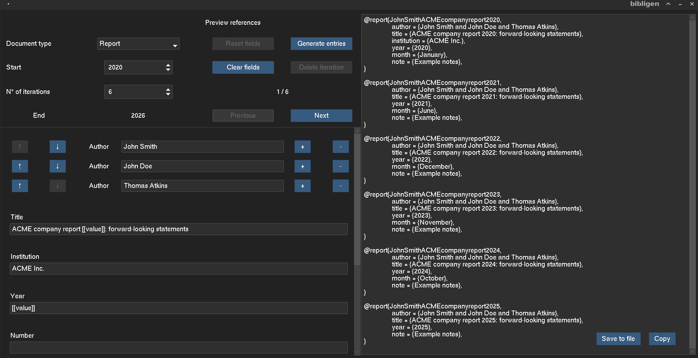

# Bibligen

A GUI tool for creating reference entries in bulk.

## The problem

Creating entries in reference managers for annual reports is very time-consuming: each entry needs to be created one by one, even though the field values are very similar - only differing the year in its title, date, url, etc.

## The solution

Bibligen is a GUI-based .bib generator for quickly creating reference entries in bulk, by allowing iterable values to be placed in the reference entries' fields (declared using `[[value]]`).


> **Important Disclaimer**: This is a hobby project made to serve the dual-purpose of solving a problem that I face frequently enough for me to create this, and for me to learn how to create something from scratch. Contributions are welcome, no commitments and no specific roadmaps are provided. Use at your own risk. This project was programmed by hand with little to no AI assistance.

<div align="center">
    
</div>

## Installation

1. Requirements

- Python >=3.13 version

- uv >=0.11 version

2. Clone the repository locally or install as .zip file, and run Bibligen from the command line

```shell
git clone <URL>
cd bibligen
uv run main.py
```

## Usage

Bibligen's main use is to generate references in bulk. Using the string pattern `[[value]]` in the fields of the first reference, Bibligen automatically replaces the string pattern with the reference's respective iteration number when generating reference entries.

### Basic workflow

- Modify `Document Type` according to desired entry type.

- Change `Start` to the desired value.

- Modify the fields of the first reference. Add the iterable flag `[[value]]` to the fields of the first reference as the iterable flag.

- Modify `Number of steps` to the number of references to be created.

- Navigate over each entry using the `Previous` and `Next` buttons, and modify fields accordingly.

- Activate `Generate entries` to pass the references to the output window. The output can be copied, or saved to file as a `.bib` file.

### Further UI details

- Document type: Bibligen supports basic [BibTex Entry types](https://bibtex.eu/types/) in addition to `Report`. Each entry type has their own unique sets of fields.

- Start: designate the start value. The field `year` of the first reference contains the iterable flag `[[value]]`. This placeholder value is replaced with the start value when the `Generate entries` button is activated.

- Step: the number of iterations. Increasing this value creates new copies of the last reference, or deletes references up to the new step value if it is decreased.

- Reset fields: reset fields in the current reference in view to be equal to the fields in the first reference, whilst preserving the iterable flag. This is used if references following the first are modified, and needs to be reset to erase any new changes.

- Generate entries: convert the references into .bib to the output window.

- Clear fields: erases contents in all fields except for those with the iterable flag `[[value]]`.

- Delete iteration: deletes the current reference in view, decrements the step value.
